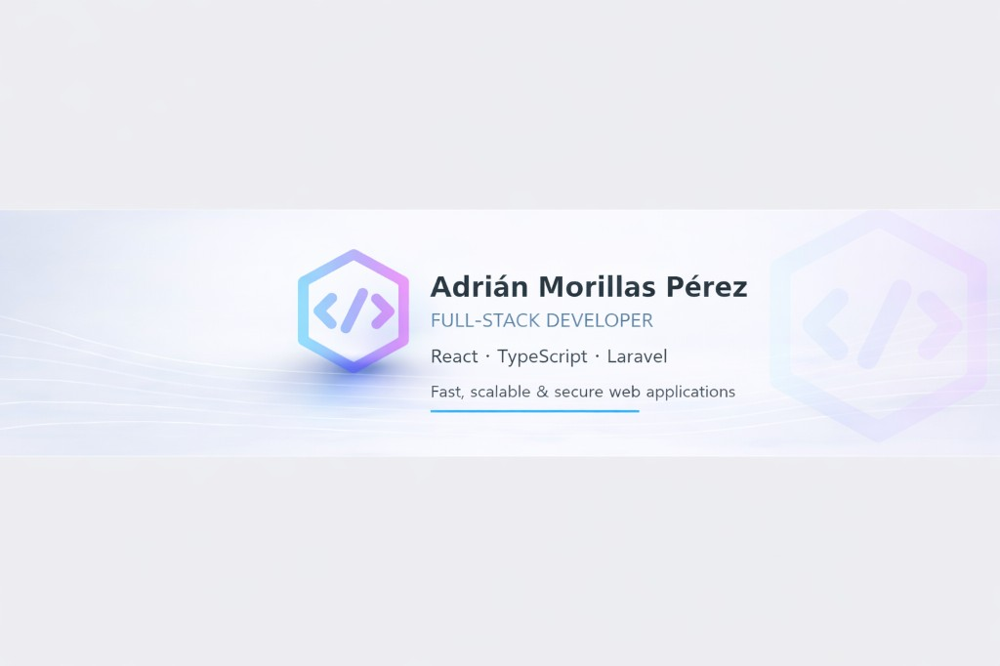

### 👋 Hi there

*I design and build modern, fast and accessible UIs and secure, well‑tested APIs for production-ready web applications.*

  
  
  

---

## 📑 Contents

- [About me](#about-me)
- [Tech stack](#tech-stack)
- [Featured projects](#featured-projects)
- [Contact](#-contact)

---

## About me

- 🔭 **Full-Stack & Backend Developer** — React, TypeScript & Laravel for modern frontends and robust APIs; Python (FastAPI) for orchestration and backend services.
- 💼 **Experience** delivering production apps: blog CMSs, business portals, production portals and AI orchestration services (see featured projects below)
- 🌍 **Based in** Barcelona, Spain · 👋 **Pronouns** he/him
- ⚡ I turn business requirements into performant, secure, and maintainable web applications, with strong focus on testing and CI/CD
- 🌱 Professional certificates in web design (IFCD0110) and web application development (IFCD0210)
- 💬 Ask me about **React**, **Laravel**, **TypeScript**, **FastAPI/Python**, or modern full-stack & API development

---

## Tech stack

  <!-- Frontend Core -->
  
  
  

  <!-- Backend & Logic -->
  
  
  

  <!-- Data & Infra -->
  
  
  

---

## Featured projects

| Project | Stack | Highlights |
|---------|-------|------------|
| [Triton Client Manager](https://github.com/adrirubim/triton_client_manager)  | Python 3.12 · FastAPI · WebSockets · Docker · OpenStack · NVIDIA Triton | Orchestration service for AI inference with threaded workers, per‑user job queues, and smoke/regression/integration tests. |
| [c41.ch-be](https://github.com/adrirubim/c41.ch-be)  | Laravel 12 · React 19 (Inertia.js) · TypeScript (strict) · Vite 7 · CI/CD | Clean Architecture + DDD, modular decoupled core, shared RichText components, and pipelines (GitHub Actions, Pint, ESLint). |
| [laser-packaging-laravel](https://github.com/adrirubim/laser-packaging-laravel)  | Laravel 12 · React 19 (Inertia.js) · PostgreSQL · PHP tests · Vitest · GitHub Actions | Offers/articles/orders + production portal (web + API), **1000+ PHP tests**, coverage, test DB, linting and type-checking. |
| [Lilaballoons Barcelona](https://www.lilaballoons.es/)  | Static site · Responsive UI · Contact form | **Live in production** — One-page site with reviews and responsive design (CP2 final project). |
| [Proyectos Front-End](https://www.adrirubim.es/cp2/index.html)  | HTML · CSS · JavaScript | Front-End projects — Professional certificate in web page design and publishing (IFCD0110). |
| [Proyectos Back-End](https://www.adrirubim.es/cp3/index.html)  | PHP · Laravel · SQL | Back-End projects — Professional certificate in web application development (IFCD0210). |

---

## Current focus

- Hardening production-ready backends with **strong testing and CI/CD** (GitHub Actions, coverage, linting).
- Designing **AI inference control planes** (OpenStack + Docker + Triton) in Python/FastAPI.
- Building **enterprise-grade Laravel + React/Inertia** apps with PostgreSQL, TypeScript and TailwindCSS.

---

## 📬 Contact

I'm currently open to new challenges, high‑impact collaborations, and Senior Full‑Stack or Backend roles. Feel free to reach out:

- 💼 **LinkedIn**: [in/adrianmorillasperez](https://www.linkedin.com/in/adrianmorillasperez/)
- 🌐 **Portfolio**: [adrirubim.es](https://www.adrirubim.es)
- ✉️ **Email**: [adrianmorillasperez@gmail.com](mailto:adrianmorillasperez@gmail.com)
- 🔗 **All links**: [linktr.ee/adrianmorillasperez](https://linktr.ee/adrianmorillasperez)

---

**"Turning complex business requirements into fast, reliable, and maintainable software."**

**[⬆ Back to top](#-contents)**

---

Thanks for visiting my profile! 🚀

